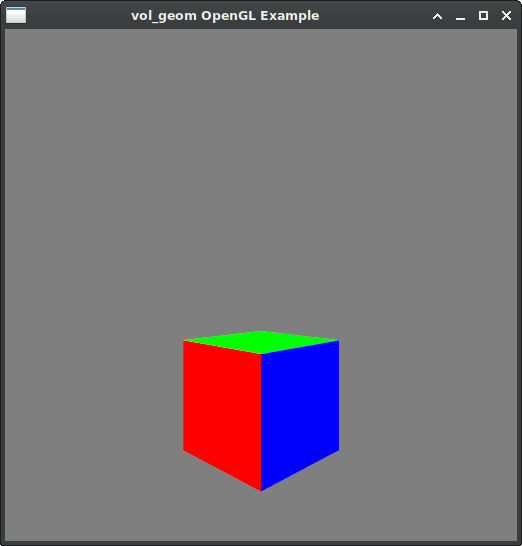

# vol_libs #

Stand-alone C libraries for extracting data from captured vologram files.
Designed to be used in native plugins for Unity and Unreal, and any custom vologram player or converter software.

See individual libraries headers for version history and current features.

| Library  | Version | Files | Description                                         | Fuzzed With                          |
|----------|---------|-------|-----------------------------------------------------|--------------------------------------|
| vol_av   | 0.7.1   | 2     | Extracts images and audio from videos using FFmpeg. | [AFL](https://github.com/google/AFL) |
| vol_geom | 0.7.1   | 2     | Extracts mesh data from header and sequence files.  | [AFL](https://github.com/google/AFL) |



| Tool    | Version | Libraries Used | Description                                                 |
|---------|---------|----------------|-------------------------------------------------------------|
| obj2vol | 0.1     | n/a            | Converts a Wavefront .obj model to a single-frame vologram. |

## How do I get set up? ##

* Clone this repository.
* Set up FFmpeg development libraries:
    * For Windows these can be found under the `thirdparty/ffmpeg_lgpl_free/` sub-directory, and you do not need to do anything.
    * On Ubuntu `sudo apt-get install build-essential clang libavcodec-dev libavdevice-dev libavformat-dev libavutil-dev libswscale-dev`.
    * On MacOS `brew install ffmpeg`.
* (Optionally) install GLFW3 library if you wish to build OpenGL example programs:
    * For Windows this can be found under `thirdparty/glfw/` and you won't need to do anything.
    * On Ubuntu `sudo apt-get install libglfw3-dev`.
    * On MacOS `brew install glfw`.
* To generate API documentation install Doxygen, and invoke `doxygen` from the main directory of the repository. 
* To build example programs with Clang, and run the simplest example:
```
make example_programs
cd examples/
./get_images.bin ../samples/counter.mp4
```
* Volograms libraries are designed to be dropped directly into a C/C++ project, or may be compiled as a static or shared library.
* For vol_av you will also need to link against the FFmpeg dynamic libraries.
* See included `examples/` folder for code examples, and `Makefile` for how they are linked against FFmpeg libraries.

## Repository Contents

```
doc/                         -- API documentation will be generated here after running `doxygen` from the main directory.
examples/                    -- Demo programs for both vol_av and vol_geom. Compile with: `make example`, and run each from the `examples/` directory.
fuzzing/                     -- Folder structure used for automated testing with the AFL fuzzer.
samples/                     -- Sample data files used by examples and tests.
samples/counter.*            -- Simple video where each frame shows the number of the frame. Handy for testing sync issues between texture and geometry.
samples/cube_hdr.vol         -- Vologram header for a simple unit-size cube mesh. It has normals and texture coordinates.
samples/cube_seq.vol         -- Vologram sequence for the cube mesh with just 1 frame.
samples/cube.mtl             -- A material file for cube.obj. Not used at the moment but included for completeness.
samples/cube.obj             -- A Wavefront .obj that the cube vologram was converted from. The `obj2vol` tool was used to convert it.
samples/out.*                -- Very short videos at 25fps with frames at different sizes. For testing edge-case handling.
src/                         -- Code for the libraries. Drop these directly into your code source to use vol_av, vol_geom, or both.
tests/                       -- Unit tests for vol_av and vol_geom. Compile with `make test`. These are run by the CI on PRs and configured with `bitbucket-pipelines.yml`.
thirdparty/                  -- Files to compile and run dependencies of vol_av and various examples.
thirdparty/apg/              -- Source code helpers used by various demos. Not required for using libraries in your own project. Mostly Public Domain helper bits from https://github.com/capnramses/apg
thirdparty/ffmpeg_lgpl_free/ -- A Windows LGPL-licence build of ffmpeg is included here for convenience. You'll need to include ffmpeg in work that uses vol_av.
thirdparty/glad/             -- GLAD is a helper utility only used for OpenGL examples. Libraries are not dependent on this. MIT licence.
thirdparty/GLFW/             -- GLFW is a helper framework only used for OpenGL examples. Libraries are not dependent on this. zlib/libpng licence.
tools/                       -- Utility programs for testing and debugging, and for exporting volograms to other formats.
tools/obj2vol/               -- A very basic Wavefront obj to Volograms converter is included here for making sample/test volograms. This was used to make the cube sample.
.clang-format                -- A clang-format file.
.gitignore                   -- Generated and binary files to exclude from the repository.
build_msvc.bat               -- MS batch file for a command-line build of the largest example. Run periodically to check for compiler warnings across libraries. 
Doxyfile                     -- Doxygen setup for CI builds. i.e. which libraries to install to run tests.
LICENSE                      -- Licence information for this project. See also: separate licences for third-party dependencies.
Makefile                     -- A GNU Makefile for building demos, tests, and samples. Used by CI builds. You can use this to build the examples in a local install if you wish.
README.md                    -- This file.
run_tests.sh                 -- Bash script for CI/CD automation to run unit tests after building on PRs. 
vol_geom.png                 -- Example vol_geom screenshot that appears in this document.
```

## Tests and Fuzzing

* Typical unit test programs for each library are found under `tests/`.
* These are built using `make`, or `make test_programs`.
* Tests can be run manually from their compiled binaries.

* Fuzzing uses the same test programs, but compiled with [AFL](https://github.com/google/AFL).
* This only runs in a Linux environment (or eg [WSL](https://docs.microsoft.com/en-us/windows/wsl/install-win10) in Windows).
* To run the fuzzer first install AFL `apt install afl`.
* And then run bash scripts found under `fuzzing/` to execute each test separately.
* Fuzzing can take some hours to complete, but can be interrupted with CTRL+C when several unique crashes are found.
* Generated files that caused crashes are found in the `..._outputs/crashes/` subdirectory for each test.
* These should be run in the regular test program, and a debugger may be used to find and fix the crash.
* Then do another iteration of fuzzing after deleting the fuzzing output directory until no more crashes are found.

## Contribution Guidelines ##

* Please feel free to open an [Issue](https://github.com/Volograms/vol_libs/issues) on this project page.
* If you are sufficiently motivated, you may also open a Pull Request from your local fork.
 
PR Descriptions should include this template:

*   Point of the PR:
*    Summary of Testing done:
*    Risk introduced by PR:
 

## Maintainers/Contact ##

* Anton Gerdelan <anton@volograms.com>
* Feel free to jump onto [Volograms Discord](https://discord.gg/dz5G4bHb) channel and chat about any of these projects, or get some troubleshooting help. 

## Licences and Dependencies ##

Copyright 2021, Volograms. The MIT License. See the LICENSE file for details.

### Dependencies

* This software uses unaltered code of <a href=http://ffmpeg.org>FFmpeg</a> licensed under the <a href=http://www.gnu.org/licenses/old-licenses/lgpl-2.1.html>LGPLv2.1</a> and its source code can be found at [FFmpeg](https://github.com/FFmpeg/FFmpeg).

See the `thirdparty/ffmpeg/LICENSE.md` file for details.

* The LGPL build of Windows FFmpeg included in this repository uses the binary of the H264 codec [openh264](https://github.com/cisco/openh264) from Cisco, which has the BSD-2-Clause Licence.

> Copyright (c) 2013, Cisco Systems
> All rights reserved.
> 
> Redistribution and use in source and binary forms, with or without modification,
> are permitted provided that the following conditions are met:
> 
> * Redistributions of source code must retain the above copyright notice, this
>   list of conditions and the following disclaimer.
> 
> * Redistributions in binary form must reproduce the above copyright notice, this
>   list of conditions and the following disclaimer in the documentation and/or
>   other materials provided with the distribution.
> 
> THIS SOFTWARE IS PROVIDED BY THE COPYRIGHT HOLDERS AND CONTRIBUTORS "AS IS" AND
> ANY EXPRESS OR IMPLIED WARRANTIES, INCLUDING, BUT NOT LIMITED TO, THE IMPLIED
> WARRANTIES OF MERCHANTABILITY AND FITNESS FOR A PARTICULAR PURPOSE ARE
> DISCLAIMED. IN NO EVENT SHALL THE COPYRIGHT HOLDER OR CONTRIBUTORS BE LIABLE FOR
> ANY DIRECT, INDIRECT, INCIDENTAL, SPECIAL, EXEMPLARY, OR CONSEQUENTIAL DAMAGES
> (INCLUDING, BUT NOT LIMITED TO, PROCUREMENT OF SUBSTITUTE GOODS OR SERVICES;
> LOSS OF USE, DATA, OR PROFITS; OR BUSINESS INTERRUPTION) HOWEVER CAUSED AND ON
> ANY THEORY OF LIABILITY, WHETHER IN CONTRACT, STRICT LIABILITY, OR TORT
> (INCLUDING NEGLIGENCE OR OTHERWISE) ARISING IN ANY WAY OUT OF THE USE OF THIS
> SOFTWARE, EVEN IF ADVISED OF THE POSSIBILITY OF SUCH DAMAGE.

### Optional Dependencies

* Examples using OpenGL make use of a the [Glad](https://glad.dav1d.de/) softare, by David Herberth, which comprises the following licences:

> The glad source code:
>
>   The MIT License (MIT)
>
>    Copyright (c) 2013-2021 David Herberth
>
>    Permission is hereby granted, free of charge, to any person obtaining a copy of
>    this software and associated documentation files (the "Software"), to deal in
>    the Software without restriction, including without limitation the rights to
>    use, copy, modify, merge, publish, distribute, sublicense, and/or sell copies of
>    the Software, and to permit persons to whom the Software is furnished to do so,
>    subject to the following conditions:
>
>    The above copyright notice and this permission notice shall be included in all
>    copies or substantial portions of the Software.
>
>    THE SOFTWARE IS PROVIDED "AS IS", WITHOUT WARRANTY OF ANY KIND, EXPRESS OR
>    IMPLIED, INCLUDING BUT NOT LIMITED TO THE WARRANTIES OF MERCHANTABILITY, FITNESS
>    FOR A PARTICULAR PURPOSE AND NONINFRINGEMENT. IN NO EVENT SHALL THE AUTHORS OR
>    COPYRIGHT HOLDERS BE LIABLE FOR ANY CLAIM, DAMAGES OR OTHER LIABILITY, WHETHER
>    IN AN ACTION OF CONTRACT, TORT OR OTHERWISE, ARISING FROM, OUT OF OR IN
>    CONNECTION WITH THE SOFTWARE OR THE USE OR OTHER DEALINGS IN THE SOFTWARE.
>
> The Khronos Specifications:
>
>    Copyright (c) 2013-2020 The Khronos Group Inc.
>
>    Licensed under the Apache License, Version 2.0 (the "License");
>    you may not use this file except in compliance with the License.
>    You may obtain a copy of the License at
>
>        http://www.apache.org/licenses/LICENSE-2.0
>
>    Unless required by applicable law or agreed to in writing, software
>    distributed under the License is distributed on an "AS IS" BASIS,
>    WITHOUT WARRANTIES OR CONDITIONS OF ANY KIND, either express or implied.
>    See the License for the specific language governing permissions and
>    limitations under the License.
>
> The EGL Specification and various headers:
>
>    Copyright (c) 2007-2016 The Khronos Group Inc.
>
>    Permission is hereby granted, free of charge, to any person obtaining a
>    copy of this software and/or associated documentation files (the
>    "Materials"), to deal in the Materials without restriction, including
>    without limitation the rights to use, copy, modify, merge, publish,
>    distribute, sublicense, and/or sell copies of the Materials, and to
>    permit persons to whom the Materials are furnished to do so, subject to
>    the following conditions:
>
>    The above copyright notice and this permission notice shall be included
>    in all copies or substantial portions of the Materials.
>
>    THE MATERIALS ARE PROVIDED "AS IS", WITHOUT WARRANTY OF ANY KIND,
>    EXPRESS OR IMPLIED, INCLUDING BUT NOT LIMITED TO THE WARRANTIES OF
>    MERCHANTABILITY, FITNESS FOR A PARTICULAR PURPOSE AND NONINFRINGEMENT.
>    IN NO EVENT SHALL THE AUTHORS OR COPYRIGHT HOLDERS BE LIABLE FOR ANY
>    CLAIM, DAMAGES OR OTHER LIABILITY, WHETHER IN AN ACTION OF CONTRACT,
>    TORT OR OTHERWISE, ARISING FROM, OUT OF OR IN CONNECTION WITH THE
>    MATERIALS OR THE USE OR OTHER DEALINGS IN THE MATERIALS.

* And the [GLFW](https://github.com/glfw/glfw) library, by Marcus Geelnard and Camilla Löwy:

> Copyright (c) 2002-2006 Marcus Geelnard
>
> Copyright (c) 2006-2019 Camilla Löwy
>
> This software is provided 'as-is', without any express or implied warranty. In no event will the authors be held liable for any damages arising from the use of this software.
> 
> Permission is granted to anyone to use this software for any purpose, including commercial applications, and to alter it and redistribute it freely, subject to the following restrictions:
> 
> The origin of this software must not be misrepresented; you must not claim that you wrote the original software. If you use this software in a product, an acknowledgment in the product documentation would be appreciated but is not required.
> 
> Altered source versions must be plainly marked as such, and must not be misrepresented as being the original software.
> 
> This notice may not be removed or altered from any source distribution.

* And [apg libraries](https://github.com/capnramses/apg) "apg_maths", and "gfx" from Anton Gerdelan, used under the Public Domain licence option:

> SECOND LICENCE OPTION

> This is free and unencumbered software released into the public domain.
>
> Anyone is free to copy, modify, publish, use, compile, sell, or
> distribute this software, either in source code form or as a compiled
> binary, for any purpose, commercial or non-commercial, and by any
> means.
>
> In jurisdictions that recognize copyright laws, the author or authors
> of this software dedicate any and all copyright interest in the
> software to the public domain. We make this dedication for the benefit
> of the public at large and to the detriment of our heirs and
> successors. We intend this dedication to be an overt act of
> relinquishment in perpetuity of all present and future rights to this
> software under copyright law.
>
> THE SOFTWARE IS PROVIDED "AS IS", WITHOUT WARRANTY OF ANY KIND,
> EXPRESS OR IMPLIED, INCLUDING BUT NOT LIMITED TO THE WARRANTIES OF
> MERCHANTABILITY, FITNESS FOR A PARTICULAR PURPOSE AND NONINFRINGEMENT.
> IN NO EVENT SHALL THE AUTHORS BE LIABLE FOR ANY CLAIM, DAMAGES OR
> OTHER LIABILITY, WHETHER IN AN ACTION OF CONTRACT, TORT OR OTHERWISE,
> ARISING FROM, OUT OF OR IN CONNECTION WITH THE SOFTWARE OR THE USE OR
> OTHER DEALINGS IN THE SOFTWARE.
>
> For more information, please refer to <http://unlicense.org>
