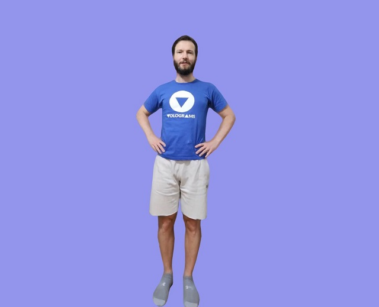

# vol_libs

<!-- [](https://github.com/Volograms/vol_libs/actions) -->
[](LICENSE)
[](https://github.com/Volograms/vol_libs/releases)
[](https://www.npmjs.com/package/@volograms/web_vol_lib)
[](https://github.com/Volograms/vol_libs/issues)
[](https://github.com/Volograms/vol_libs/pulls)
[](https://discord.gg/nuDP5jjZ5q)
[](#)

**A modular C/C++ library suite for loading, processing, and playing volumetric video (volograms) across native, web, and game engine platforms.**  
Easily extract mesh, texture, and audio data from vologram files for use in custom players, converters, or real-time applications.

The libraries here are designed to be used in native plugins for Unity, Unreal and web pages, and can also be used to drive any custom vologram player or converter software. This will give you frame-by-frame triangulated mesh data, with images for the texture, that can be used with any API.

## 🚀 Quick Start

### Try the Web Demo (Coming Soon)

A live web demo will be available soon!  
You'll be able to load and play vologram files directly in your browser.

#### Run the Web Demo Locally

**Option 1: Using PowerShell (Windows only)**
```powershell
# From the project root or wasm directory
.\serve.ps1
# Then open http://localhost:8000/examples/05_vol_player_wasm/index_opfs.html in your browser
```

**Option 2: Using http-server (Cross-platform, requires Node.js)**
```sh
npm install -g http-server
http-server
# Then open http://localhost:8080/examples/05_vol_player_wasm/index_three.html in your browser
```

<!--
Once available, you'll be able to try it here:
[Live Demo](https://<username>.github.io/<repo>/)
-->

---

### Native C++ (Advanced/Custom Use)

1. **Clone and build:**
   ```sh
   git clone https://github.com/Volograms/vol_libs.git
   cd vol_libs
   make test_programs
   cd tests/
   ./geom_test.bin
   ./av_test.bin
   ```

2. **See [Set Up](#set-up) below for platform-specific instructions.**

<!-- See individual libraries headers for version history and current features.

| Library  | Version | Files | Description                                         | Fuzzed With                          |
| -------- | ------- | ----- | --------------------------------------------------- | ------------------------------------ |
| vol_av   | 0.9     | 2     | Extracts images and audio from videos using FFmpeg. | [AFL](https://github.com/google/AFL) |
| vol_geom | 0.10    | 2     | Extracts mesh data from header and sequence files.  | [AFL](https://github.com/google/AFL) |

| Tool    | Version | Libraries Used | Description                                                 |
| ------- | ------- | -------------- | ----------------------------------------------------------- |
| obj2vol | 0.1     | n/a            | Converts a Wavefront .obj model to a single-frame vologram. | -->


<!--  -->

<!-- *vol_geom used to load a simple Vologram and render it in OpenGL.* -->

## Installation

* Clone this repository.
* (Not required for web) Set up FFmpeg development libraries:
    * For Windows these can be found under the `thirdparty/ffmpeg_lgpl_free/` sub-directory, and you do not need to do anything.
    * On Ubuntu `sudo apt-get install build-essential clang libavcodec-dev libavdevice-dev libavformat-dev libavutil-dev libswscale-dev`.
    * On macOS `brew install ffmpeg`.
* (Optionally) install GLFW3 library if you wish to build OpenGL example programs:
    * For Windows this can be found under `thirdparty/glfw/` and you won't need to do anything.
    * On Ubuntu `sudo apt-get install libglfw3-dev`.
    * On macOS `brew install glfw`.
* Compile and run the test programs to check you have everything set up. These just produce text output.
```
make test_programs
cd tests/
./geom_test.bin
./av_test.bin
```

### Usage

* Volograms libraries are designed to be dropped directly into a C/C++ project, or may be compiled as a static or shared library, or as web assembly (WASM).
* To play volograms that use external WebM or MP4 video textures you need to use vol_av. This links against the FFmpeg dynamic libraries. _Web players do not use vol_av or FFmpeg_.
* `#include vol_av.h` or `#include vol_geom.h` and call interface functions from those headers.
* Library functions are documented in the header files.
* You can also generate API documentation using Doxygen. To do so install Doxygen, and invoke `doxygen` from the main directory of the repository.

### Example Programs

* `examples/` contains *code examples* for how you might invoke the libraries in your projects to render volograms.
* See the table below for what each example is and how to use it.
* For a visual output example try *vol_geom_av_opengl* to load a Vologram you have captured with Volu and exported to the desktop.

To build optional example programs (requires GLFW3) with Clang:

```
make example_programs
cd examples/
`./vol_geom_av_opengl.bin PATH_TO_MY/header.vols PATH_TO_MY/sequence_0.vols PATH_TO_MY/texture_2048_h264.mp4`
```
To run web examples start an https server ([http-server](https://www.npmjs.com/package/http-server)) inside the root folder or use `serve.ps1` (Windows only but needed for the OPFS example). For example:
```
// create a certificate 
openssl req -newkey rsa:2048 -new -nodes -x509 -days 3650 -keyout key.pem -out cert.pem

// run https server
http-server -S -C cert.pem

// Open in web browser https://127.0.0.1:8080/examples/05_vol_player_wasm/index_three.html
```
| Example               | Description                                                                                                                                                                                                                                                                           | Parameters                                                                         |
| --------------------- | ------------------------------------------------------------------------------------------------------------------------------------------------------------------------------------------------------------------------------------------------------------------------------------- | ---------------------------------------------------------------------------------- |
| get_images            | Example code showing how to use vol_av to fetch textures from the video.                                                                                                                                                                                                              | `./get_images.bin ../samples/counter.webm`                                         |
| dump_images           | As `get_images` but dumps images to files.                                                                                                                                                                                                                                            | `./dump_images.bin ../samples/counter.webm`                                        |
| vol_geom_opengl       | Example using vol_geom to load mesh frames from a vologram and render in OpenGL without a texture. Loads a cube by default,  or supply a path to a vologram header and sequence file.                                                                                                 | `./vol_geom_opengl.bin ../samples/cone_hdr.vol ../samples/cone_seq.vol`            |
| vol_geom_av_opengl    | Combines both vol_geom and vol_av and renders a textured vologram sequence in OpenGL. Displays the first frame of a video on a quad by default, but supply paths to a header, sequence, and video file to display a vologram. Advance one frame with `spacebar`, play/pause with `p`. |                                                                                    |
| vol_geom_wasm_webgl   | Plays a vologram in a webpage, with WebGL, using vol_geom compiled to web assembly.                                                                                                                                                                                                   | Host an HTTP server from the project's root directory, and connect with a browser. |
| vol_geom_wasm_threejs | Plays a vologram in a webpage, with [Three.js](https://threejs.org/), using vol_geom compiled to web assembly.                                                                                                                                                                        | Host an HTTP server from the project's root directory, and connect with a browser. |
| vol_geom_single_file  | Use vol_geom to play a vologram where the header, sequence, and texture are all in one .vols file.                                                                                                                                                                                    | `./vol_geom_single_file.bin samples/combined.vols`                                 |



*04_vol_geom_wasm_webgl used to load a Vologram captured with Volu and animate it in WebGL.*

### Troubleshooting

Homebrew on M1 Macs may require environment variables to be set: 

```
export CPATH=/opt/homebrew/include
export LIBRARY_PATH=/opt/homebrew/lib
```

There is a more detailed answer at https://apple.stackexchange.com/questions/414622/installing-a-c-c-library-with-homebrew-on-m1-macs

## Tests and Fuzzing

* Typical unit test programs for each library are found under `tests/`.
* These are built using `make`, or `make test_programs`.
* Tests can be run manually from their compiled binaries.

* Fuzzing uses the same test programs, but compiled with [AFL](https://github.com/google/AFL).
* This only runs in a Linux environment (or eg [WSL](https://docs.microsoft.com/en-us/windows/wsl/install-win10) in Windows).
* To run the fuzzer first install AFL `apt install afl`.
* And then run bash scripts found under `fuzzing/` to execute each test separately.
* Fuzzing can take some hours to complete, but can be interrupted with CTRL+C when several unique crashes are found.
* Generated files that caused crashes are found in the `..._outputs/crashes/` subdirectory for each test.
* These should be run in the regular test program, and a debugger may be used to find and fix the crash.
* Then do another iteration of fuzzing after deleting the fuzzing output directory until no more crashes are found.

## Contribution Guidelines ##

* Please feel free to open an [Issue](https://github.com/Volograms/vol_libs/issues) on this project page.
* If you are sufficiently motivated, you may also open a Pull Request from your local fork.
 
PR Descriptions should include this template:

*   Point of the PR:
*    Summary of Testing done:
*    Risk introduced by PR:
 

## Maintainers/Contact ##

* Feel free to jump onto [Volograms Discord](https://discord.gg/dz5G4bHb) channel and chat about any of these projects, or get some troubleshooting help. 

## Licences and Dependencies ##

Copyright 2021-2023, Volograms. The MIT License. See the LICENSE file for details.

### Dependencies

* This software uses the unaltered transcoder from [Basis Universal](https://binomialllc.github.io/basis_universal/) by [Binomial](http://www.binomial.info/). The transcoder, in turn, uses some code under zlib and BSD (Zstandard). The supported texture formats are [open Khronos Group standards](https://www.khronos.org/registry/DataFormat/specs/1.1/dataformat.1.1.html).
  <details>
  <summary>Show Basis Universal License</summary>

  > Licensed under the Apache License, Version 2.0 (the "License");
  > you may not use this file except in compliance with the License.
  > You may obtain a copy of the License at
  > 
  >     http://www.apache.org/licenses/LICENSE-2.0
  > 
  > Unless required by applicable law or agreed to in writing, software
  > distributed under the License is distributed on an "AS IS" BASIS,
  > WITHOUT WARRANTIES OR CONDITIONS OF ANY KIND, either express or implied.
  > See the License for the specific language governing permissions and
  > limitations under the License.

  </details>

* This software uses unaltered code of [FFmpeg](http://ffmpeg.org) licensed under the LGPLv2.1.
  <details>
  <summary>Show FFmpeg License</summary>

  > FFmpeg is licensed under the GNU Lesser General Public License (LGPL) version 2.1 or later. See the LICENSE file in the FFmpeg source for details.
  > 
  > For more information, see: http://www.gnu.org/licenses/old-licenses/lgpl-2.1.html

  </details>

* The LGPL build of Windows FFmpeg included in this repository uses the binary of the H264 codec [openh264](https://github.com/cisco/openh264) from Cisco, which has the BSD-2-Clause Licence.
  <details>
  <summary>Show OpenH264 License</summary>

  > Copyright (c) 2013, Cisco Systems
  > All rights reserved.
  > 
  > Redistribution and use in source and binary forms, with or without modification,
  > are permitted provided that the following conditions are met:
  > 
  > * Redistributions of source code must retain the above copyright notice, this
  >   list of conditions and the following disclaimer.
  > 
  > * Redistributions in binary form must reproduce the above copyright notice, this
  >   list of conditions and the following disclaimer in the documentation and/or
  >   other materials provided with the distribution.
  > 
  > THIS SOFTWARE IS PROVIDED BY THE COPYRIGHT HOLDERS AND CONTRIBUTORS "AS IS" AND
  > ANY EXPRESS OR IMPLIED WARRANTIES, INCLUDING, BUT NOT LIMITED TO, THE IMPLIED
  > WARRANTIES OF MERCHANTABILITY AND FITNESS FOR A PARTICULAR PURPOSE ARE
  > DISCLAIMED. IN NO EVENT SHALL THE COPYRIGHT HOLDER OR CONTRIBUTORS BE LIABLE FOR
  > ANY DIRECT, INDIRECT, INCIDENTAL, SPECIAL, EXEMPLARY, OR CONSEQUENTIAL DAMAGES
  > (INCLUDING, BUT NOT LIMITED TO, PROCUREMENT OF SUBSTITUTE GOODS OR SERVICES;
  > LOSS OF USE, DATA, OR PROFITS; OR BUSINESS INTERRUPTION) HOWEVER CAUSED AND ON
  > ANY THEORY OF LIABILITY, WHETHER IN CONTRACT, STRICT LIABILITY, OR TORT
  > (INCLUDING NEGLIGENCE OR OTHERWISE) ARISING IN ANY WAY OUT OF THE USE OF THIS
  > SOFTWARE, EVEN IF ADVISED OF THE POSSIBILITY OF SUCH DAMAGE.

  </details>

### Optional Dependencies

* Examples using OpenGL make use of the [Glad](https://glad.dav1d.de/) software, by David Herberth, which comprises the following licences:
  <details>
  <summary>Show Glad License</summary>

  > The glad source code:
  >
  >   The MIT License (MIT)
  >
  >    Copyright (c) 2013-2021 David Herberth
  >
  >    Permission is hereby granted, free of charge, to any person obtaining a copy of
  >    this software and associated documentation files (the "Software"), to deal in
  >    the Software without restriction, including without limitation the rights to
  >    use, copy, modify, merge, publish, distribute, sublicense, and/or sell copies of
  >    the Software, and to permit persons to whom the Software is furnished to do so,
  >    subject to the following conditions:
  >
  >    The above copyright notice and this permission notice shall be included in all
  >    copies or substantial portions of the Software.
  >
  >    THE SOFTWARE IS PROVIDED "AS IS", WITHOUT WARRANTY OF ANY KIND, EXPRESS OR
  >    IMPLIED, INCLUDING BUT NOT LIMITED TO THE WARRANTIES OF MERCHANTABILITY, FITNESS
  >    FOR A PARTICULAR PURPOSE AND NONINFRINGEMENT. IN NO EVENT SHALL THE AUTHORS OR
  >    COPYRIGHT HOLDERS BE LIABLE FOR ANY CLAIM, DAMAGES OR OTHER LIABILITY, WHETHER
  >    IN AN ACTION OF CONTRACT, TORT OR OTHERWISE, ARISING FROM, OUT OF OR IN
  >    CONNECTION WITH THE SOFTWARE OR THE USE OR OTHER DEALINGS IN THE SOFTWARE.
  >
  > The Khronos Specifications:
  >
  >    Copyright (c) 2013-2020 The Khronos Group Inc.
  >
  >    Licensed under the Apache License, Version 2.0 (the "License");
  >    you may not use this file except in compliance with the License.
  >    You may obtain a copy of the License at
  >
  >        http://www.apache.org/licenses/LICENSE-2.0
  >
  >    Unless required by applicable law or agreed to in writing, software
  >    distributed under the License is distributed on an "AS IS" BASIS,
  >    WITHOUT WARRANTIES OR CONDITIONS OF ANY KIND, either express or implied.
  >    See the License for the specific language governing permissions and
  >    limitations under the License.
  >
  > The EGL Specification and various headers:
  >
  >    Copyright (c) 2007-2016 The Khronos Group Inc.
  >
  >    Permission is hereby granted, free of charge, to any person obtaining a
  >    copy of this software and/or associated documentation files (the
  >    "Materials"), to deal in the Materials without restriction, including
  >    without limitation the rights to use, copy, modify, merge, publish,
  >    distribute, sublicense, and/or sell copies of the Materials, and to
  >    permit persons to whom the Materials are furnished to do so, subject to
  >    the following conditions:
  >
  >    The above copyright notice and this permission notice shall be included
  >    in all copies or substantial portions of the Materials.
  >
  >    THE MATERIALS ARE PROVIDED "AS IS", WITHOUT WARRANTY OF ANY KIND,
  >    EXPRESS OR IMPLIED, INCLUDING BUT NOT LIMITED TO THE WARRANTIES OF
  >    MERCHANTABILITY, FITNESS FOR A PARTICULAR PURPOSE AND NONINFRINGEMENT.
  >    IN NO EVENT SHALL THE AUTHORS OR COPYRIGHT HOLDERS BE LIABLE FOR ANY
  >    CLAIM, DAMAGES OR OTHER LIABILITY, WHETHER IN AN ACTION OF CONTRACT,
  >    TORT OR OTHERWISE, ARISING FROM, OUT OF OR IN CONNECTION WITH THE
  >    MATERIALS OR THE USE OR OTHER DEALINGS IN THE MATERIALS.

  </details>

* And the [GLFW](https://github.com/glfw/glfw) library, by Marcus Geelnard and Camilla Löwy:
  <details>
  <summary>Show GLFW License</summary>

  > Copyright (c) 2002-2006 Marcus Geelnard
  >
  > Copyright (c) 2006-2019 Camilla Löwy
  >
  > This software is provided 'as-is', without any express or implied warranty. In no event will the authors be held liable for any damages arising from the use of this software.
  > 
  > Permission is granted to anyone to use this software for any purpose, including commercial applications, and to alter it and redistribute it freely, subject to the following restrictions:
  > 
  > The origin of this software must not be misrepresented; you must not claim that you wrote the original software. If you use this software in a product, an acknowledgment in the product documentation would be appreciated but is not required.
  > 
  > Altered source versions must be plainly marked as such, and must not be misrepresented as being the original software.
  > 
  > This notice may not be removed or altered from any source distribution.

  </details>

* And [apg libraries](https://github.com/capnramses/apg) "apg_maths", and "gfx" from Anton Gerdelan, used under the Public Domain licence option:
  <details>
  <summary>Show APG Libraries License</summary>

  > This is free and unencumbered software released into the public domain.
  >
  > Anyone is free to copy, modify, publish, use, compile, sell, or
  > distribute this software, either in source code form or as a compiled
  > binary, for any purpose, commercial or non-commercial, and by any
  > means.
  >
  > In jurisdictions that recognize copyright laws, the author or authors
  > of this software dedicate any and all copyright interest in the
  > software to the public domain. We make this dedication for the benefit
  > of the public at large and to the detriment of our heirs and
  > successors. We intend this dedication to be an overt act of
  > relinquishment in perpetuity of all present and future rights to this
  > software under copyright law.
  >
  > THE SOFTWARE IS PROVIDED "AS IS", WITHOUT WARRANTY OF ANY KIND,
  > EXPRESS OR IMPLIED, INCLUDING BUT NOT LIMITED TO THE WARRANTIES OF
  > MERCHANTABILITY, FITNESS FOR A PARTICULAR PURPOSE AND NONINFRINGEMENT.
  > IN NO EVENT SHALL THE AUTHORS BE LIABLE FOR ANY CLAIM, DAMAGES OR
  > OTHER LIABILITY, WHETHER IN AN ACTION OF CONTRACT, TORT OR OTHERWISE,
  > ARISING FROM, OUT OF OR IN CONNECTION WITH THE SOFTWARE OR THE USE OR
  > OTHER DEALINGS IN THE SOFTWARE.
  >
  > For more information, please refer to <http://unlicense.org>

  </details>

* Web example created using [three.js](https://github.com/mrdoob/three.js/):
  <details>
  <summary>Show Three.js License</summary>

  > The MIT License
  >
  > Copyright © 2010-2023 three.js authors
  >
  > Permission is hereby granted, free of charge, to any person obtaining a copy
  > of this software and associated documentation files (the "Software"), to deal
  > in the Software without restriction, including without limitation the rights
  > to use, copy, modify, merge, publish, distribute, sublicense, and/or sell
  > copies of the Software, and to permit persons to whom the Software is
  > furnished to do so, subject to the following conditions:
  >
  > The above copyright notice and this permission notice shall be included in
  > all copies or substantial portions of the Software.
  > 
  > THE SOFTWARE IS PROVIDED "AS IS", WITHOUT WARRANTY OF ANY KIND, EXPRESS OR
  > IMPLIED, INCLUDING BUT NOT LIMITED TO THE WARRANTIES OF MERCHANTABILITY,
  > FITNESS FOR A PARTICULAR PURPOSE AND NONINFRINGEMENT. IN NO EVENT SHALL THE
  > AUTHORS OR COPYRIGHT HOLDERS BE LIABLE FOR ANY CLAIM, DAMAGES OR OTHER
  > LIABILITY, WHETHER IN AN ACTION OF CONTRACT, TORT OR OTHERWISE, ARISING FROM,
  > OUT OF OR IN CONNECTION WITH THE SOFTWARE OR THE USE OR OTHER DEALINGS IN
  > THE SOFTWARE.

  </details>

* Web modules are built with [emscripten]() which uses the following licences: 
  <details>
  <summary>Show Emscripten License</summary>

  > Emscripten is available under 2 licenses, the MIT license and the
  > University of Illinois/NCSA Open Source License.
  >
  > Both are permissive open source licenses, with little if any
  > practical difference between them.
  >
  > The reason for offering both is that (1) the MIT license is
  > well-known, while (2) the University of Illinois/NCSA Open Source
  > License allows Emscripten's code to be integrated upstream into
  > LLVM, which uses that license, should the opportunity arise.
  >
  > The full text of both licenses follows.
  >
  > ===============================================================================
  >
  > Copyright (c) 2010-2014 Emscripten authors, see AUTHORS file.
  > 
  > Permission is hereby granted, free of charge, to any person obtaining a copy
  > of this software and associated documentation files (the "Software"), to deal
  > in the Software without restriction, including without limitation the rights
  > to use, copy, modify, merge, publish, distribute, sublicense, and/or sell
  > copies of the Software, and to permit persons to whom the Software is
  > furnished to do so, subject to the following conditions:
  > 
  > The above copyright notice and this permission notice shall be included in
  > all copies or substantial portions of the Software.
  > 
  > THE SOFTWARE IS PROVIDED "AS IS", WITHOUT WARRANTY OF ANY KIND, EXPRESS OR
  > IMPLIED, INCLUDING BUT NOT LIMITED TO THE WARRANTIES OF MERCHANTABILITY,
  > FITNESS FOR A PARTICULAR PURPOSE AND NONINFRINGEMENT. IN NO EVENT SHALL THE
  > CONTRIBUTORS OR COPYRIGHT HOLDERS BE LIABLE FOR ANY CLAIM, DAMAGES OR OTHER
  > LIABILITY, WHETHER IN AN ACTION OF CONTRACT, TORT OR OTHERWISE, ARISING FROM,
  > OUT OF OR IN CONNECTION WITH THE SOFTWARE OR THE USE OR OTHER DEALINGS WITH THE SOFTWARE.
  > 
  > ===============================================================================
  > 
  > Copyright (c) 2010-2014 Emscripten authors, see AUTHORS file.
  > All rights reserved.
  >
  > Permission is hereby granted, free of charge, to any person obtaining a
  > copy of this software and associated documentation files (the
  > "Software"), to deal with the Software without restriction, including
  > without limitation the rights to use, copy, modify, merge, publish,
  > distribute, sublicense, and/or sell copies of the Software, and to
  > permit persons to whom the Software is furnished to do so, subject to
  > the following conditions:
  >
  >   Redistributions of source code must retain the above copyright
  >   notice, this list of conditions and the following disclaimers.
  >
  >   Redistributions in binary form must reproduce the above
  >   copyright notice, this list of conditions and the following disclaimers
  >   in the documentation and/or other materials provided with the
  >   distribution.
  > 
  >   Neither the names of Mozilla,
  >   nor the names of its contributors may be used to endorse
  >   or promote products derived from this Software without specific prior
  >   written permission. 
  >
  > THE SOFTWARE IS PROVIDED "AS IS", WITHOUT WARRANTY OF ANY KIND, EXPRESS
  > OR IMPLIED, INCLUDING BUT NOT LIMITED TO THE WARRANTIES OF
  > MERCHANTABILITY, FITNESS FOR A PARTICULAR PURPOSE AND NONINFRINGEMENT.
  > IN NO EVENT SHALL THE CONTRIBUTORS OR COPYRIGHT HOLDERS BE LIABLE FOR
  > ANY CLAIM, DAMAGES OR OTHER LIABILITY, WHETHER IN AN ACTION OF CONTRACT,
  > TORT OR OTHERWISE, ARISING FROM, OUT OF OR IN CONNECTION WITH THE
  > SOFTWARE OR THE USE OR OTHER DEALINGS WITH THE SOFTWARE.
  >
  > ===============================================================================
  > 
  > This program uses portions of Node.js source code located in src/library_path.js,
  > in accordance with the terms of the MIT license. Node's license follows:
  >
  >   Copyright Joyent, Inc. and other Node contributors. All rights reserved.
  >   Permission is hereby granted, free of charge, to any person obtaining a copy
  >   of this software and associated documentation files (the "Software"), to
  >   deal in the Software without restriction, including without limitation the
  >   rights to use, copy, modify, merge, publish, distribute, sublicense, and/or
  >   sell copies of the Software, and to permit persons to whom the Software is
  >   furnished to do so, subject to the following conditions:
  >
  >   The above copyright notice and this permission notice shall be included in
  >   all copies or substantial portions of the Software.
  >
  >   THE SOFTWARE IS PROVIDED "AS IS", WITHOUT WARRANTY OF ANY KIND, EXPRESS OR
  >   IMPLIED, INCLUDING BUT NOT LIMITED TO THE WARRANTIES OF MERCHANTABILITY,
  >   FITNESS FOR A PARTICULAR PURPOSE AND NONINFRINGEMENT. IN NO EVENT SHALL THE
  >   AUTHORS OR COPYRIGHT HOLDERS BE LIABLE FOR ANY CLAIM, DAMAGES OR OTHER
  >   LIABILITY, WHETHER IN AN ACTION OF CONTRACT, TORT OR OTHERWISE, ARISING
  >   FROM, OUT OF OR IN CONNECTION WITH THE SOFTWARE OR THE USE OR OTHER DEALINGS
  >   IN THE SOFTWARE.
  >
  > The musl libc project is bundled in this repo, and it has the MIT license, see
  > system/lib/libc/musl/COPYRIGHT
  >
  > The third_party/ subdirectory contains code with other licenses. None of it is
  > used by default, but certain options use it (e.g., the optional closure compiler
  > flag will run closure compiler from third_party/).

  </details>
